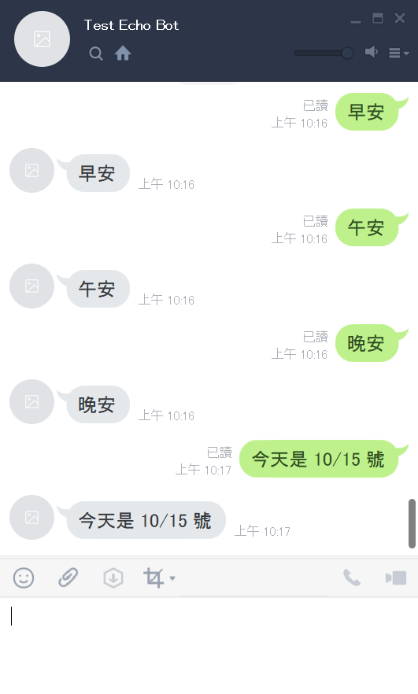
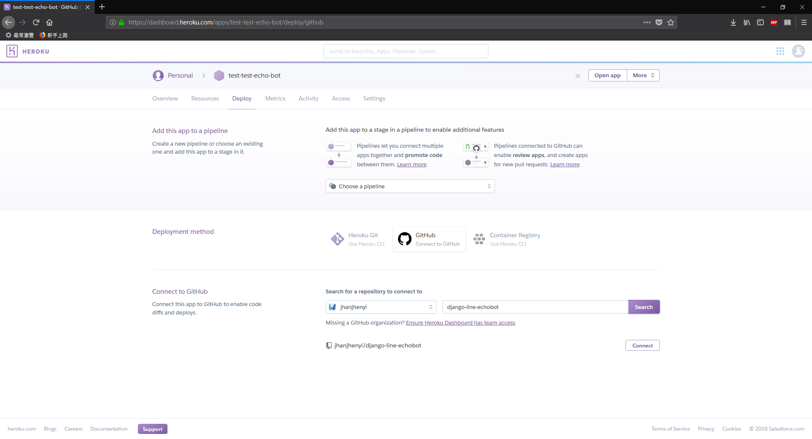
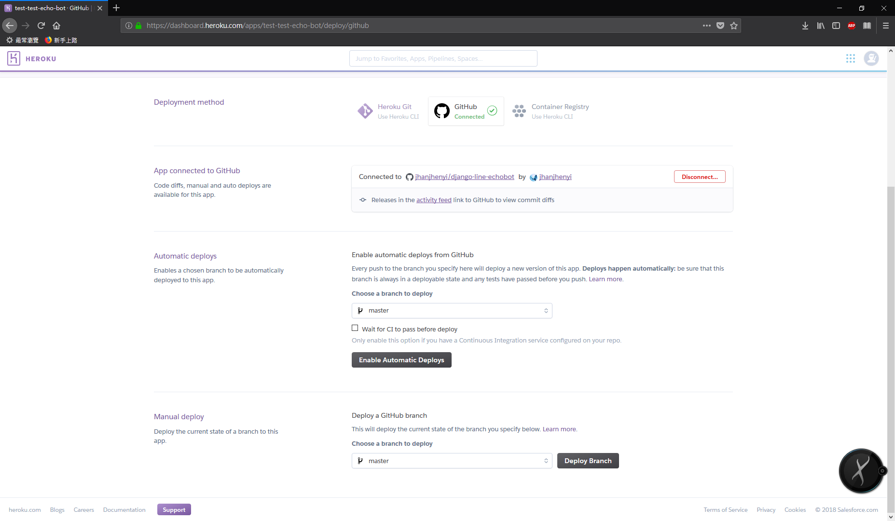
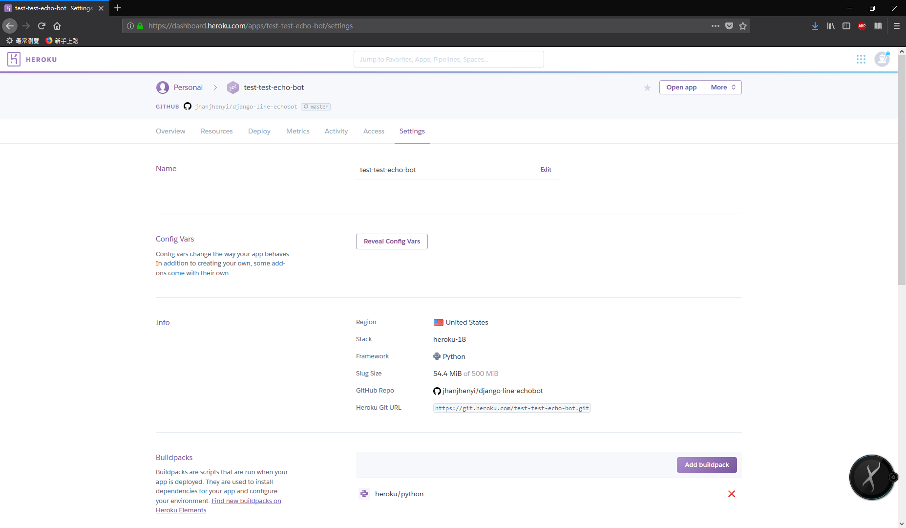

# Django Line Echo Bot

Line Echo Bot 的實作紀錄



## 使用到的東西
- [Python 3.7](https://www.python.org/)
- [ngrok](https://ngrok.com/)
- [line-bot-sdk-python](https://github.com/line/line-bot-sdk-python)
- [Heroku](https://www.heroku.com/)
- [Django](https://www.djangoproject.com/)

## 開發

### 建立虛擬環境

寫 Python 必備的虛擬環境，可隨意選擇
- [venv](https://docs.python.org/3/library/venv.html)
- [Virtualenv](https://virtualenv.pypa.io/en/stable/)
- [Pipenv](https://pipenv.readthedocs.io/en/latest/)

```
$ pip install Django
$ pip install line-bot-sdk
```

### 建立 Django 專案

```
$ django-admin startproject django_line_bot
$ cd django_line_bot
$ python manage.py startapp echobot
```

### 設定 Webhook URL


為了讓 Line 可以把收到的訊息傳給程式

我們將接收的 Webhook URL 設計成 ```https://{domain name}/echobot/callback/```

#### django_line_bot/urls.py

```python
from django.contrib import admin
from django.urls import include, path

urlpatterns = [
    path('admin/', admin.site.urls),
    path('echobot/', include('echobot.urls')),
]
```

#### echobot/urls.py

```python
from django.urls import path

from . import views

urlpatterns = [
    path('callback/', views.callback, name='callback'),
]
```

### 實作 Echo Function

再來就是要在 ```echobot/views.py``` 裡實作 ```callback```

官方已經有提供 Flask 的 Echo-bot 範例
[flask-echo](https://github.com/line/line-bot-sdk-python/tree/master/examples/flask-echo)

```python
from django.conf import settings
from django.http import HttpRequest, HttpResponse, HttpResponseBadRequest
from django.views.decorators.csrf import csrf_exempt

from linebot import LineBotApi, WebhookHandler
from linebot.exceptions import InvalidSignatureError
from linebot.models import MessageEvent, TextMessage, TextSendMessage

line_bot_api = LineBotApi('CHANNEL_ACCESS_TOKEN')
handler = WebhookHandler('CHANNEL_SECRET')


@csrf_exempt
def callback(request: HttpRequest) -> HttpResponse:
    
    if request.method == "POST":
        # get X-Line-Signature header value
        signature = request.META['HTTP_X_LINE_SIGNATURE']

        # get request body as text
        body = request.body.decode('utf-8')

        # handle webhook body
        try:
            handler.handle(body, signature)
        except InvalidSignatureError:
            return HttpResponseBadRequest()

        return HttpResponse()
    else:
        return HttpResponseBadRequest()


@handler.add(MessageEvent, message=TextMessage)
def message_text(event: MessageEvent):
    line_bot_api.reply_message(
        event.reply_token,
        TextSendMessage(text=event.message.text)
    )
```

到這裡，實作的部分就差不多了

## LINE Developers

再來就要到 [Line Developers](https://developers.line.me/en/) 的頁面去申請 Bot

申請流程就不記錄了，總之這是我申請的 Bot


點進去之後在 **Channel settings** 的頁面中會有一些資訊需要記下來給程式使用，如果沒有的話可以按 Issue 按紐來產生
- Channel secret
- Channel access token

再來有兩個地方需要設定，由於我們需要將讓 Line 知道要把訊息轉給誰，因此要把 ```Use webhooks``` 設定成 ```Enabled```，```Webhook URL``` 則是設定成前面設計的 Webhook URL，不過目前尚未將程式部署到網路上所以稍後再設定
- Use webhooks
- Webhook URL

另外 ```Auto-reply messages``` 也可以 ```Disabled``` ，因為回覆訊息的功能將全部交給程式處理

## 部署

我們需要將程式部署到 Server 上，這邊會記錄兩種做法
- ngrok
- Heroku

### ngrok

ngrok 可以將 localhost URLs 對應到 Public URLs

具體來說就是 ngrok 會產生一個 Public URL，讓 Line 可以發訊息過來，ngrok 則是會傳給這個 Public URL 的對應的 localhost URL，在這裡指的是 Django 在本機 ```runserver``` 時的 ```http://127.0.0.1:8000/``` 


相關資訊請參考官網 [ngrok](https://ngrok.com/)

使用上也很簡單，上官網註冊帳號、下載程式、設定 Auth token 之後，就可以用指令來處理我們的需求了

```
$ ngrok http 8000
```

就會出現以下畫面，然後我們就能將畫面中的 ```https://92832de0.ngrok.io``` 設定到前面在 LINE Developers 裡有提到需要設定的 ```Webhook URL```

```
ngrok by @inconshreveable                                                           (Ctrl+C to quit)
Session Status                online
Version                       2.2.8
Region                        United States (us)
Web Interface                 http://127.0.0.1:4040
Forwarding                    http://92832de0.ngrok.io -> localhost:8000
Forwarding                    https://92832de0.ngrok.io -> localhost:8000

Connections                   ttl     opn     rt1     rt5     p50     p90
                              0       0       0.00    0.00    0.00    0.00
```

這樣應該就能測試了

### Heroku

基本上 ngrok 是拿來當本機測試用，實際上還是要部署到網路上，這次使用 Heroku 來部署

相關資訊請參考官網 [Heroku](https://www.heroku.com/)

先建立一個新的 App，在個人的 Dashboard 頁面 New -> Create new app

在 Deploy 的頁面上會告訴你有三種方式，網路上其他教學大多是使用 Heroku Git，這邊我就直接 Heroku 的頁面上操作

點選 GitHub 連結帳號後，輸入對應的 Repository 再 Connect 之後底下就會出現 deploy 的設定





```Automatic deploys``` 是自動部署，只要這個 Repository 有新的 Commit 就會自動更新部署

```Manual deploy``` 則是手動部署，按下去 Deploy Branch 才會部署

最後在 Settings 的頁面上可以找到這個 App 的 URL

就可以將這個 URL 設定到前面在 LINE Developers 裡有提到需要設定的 ```Webhook URL```

至於前面提到的
- Channel secret
- Channel access token

則可以在 Settings 頁面的 ```Coonfig Vars``` 這裡設定參數




接下來就是可以單純更新 Repository 讓他自動部署，直接測試了

關於在 Heroku 部署 Django 的部分可以參考官方文件 [Working with Django](https://devcenter.heroku.com/categories/working-with-django)

簡單來說就是需要 ```Pipfile``` 或 ```requirements.txt``` 在專案根目錄，來識別是 Python

還有 ```Procfile``` 檔案

```
web: gunicorn --pythonpath django_line_bot django_line_bot.wsgi
```

gunicorn 的部分可以參考官網 [gunicorn](https://gunicorn.org/)

## 參考資料
- [Line Echo Bot on Django](http://lee-w.github.io/posts/bot/2016/11/line-echo-bot-on-django/)
- [手把手教你搭建聊天機器人(LineBot+Python+QnAMaker+Heroku)-02建造LineBot Backend Server 並部署至Heroku](https://medium.com/@hatsukiotowa/%E6%89%8B%E6%8A%8A%E6%89%8B%E6%95%99%E4%BD%A0%E6%90%AD%E5%BB%BA%E8%81%8A%E5%A4%A9%E6%A9%9F%E5%99%A8%E4%BA%BA-linebot-python-qnamaker-heroku-02%E5%BB%BA%E9%80%A0linebot-backend-server-%E4%B8%A6%E9%83%A8%E7%BD%B2%E8%87%B3heroku-59b36357cd9d)
- [Working with Django](https://devcenter.heroku.com/categories/working-with-django)
